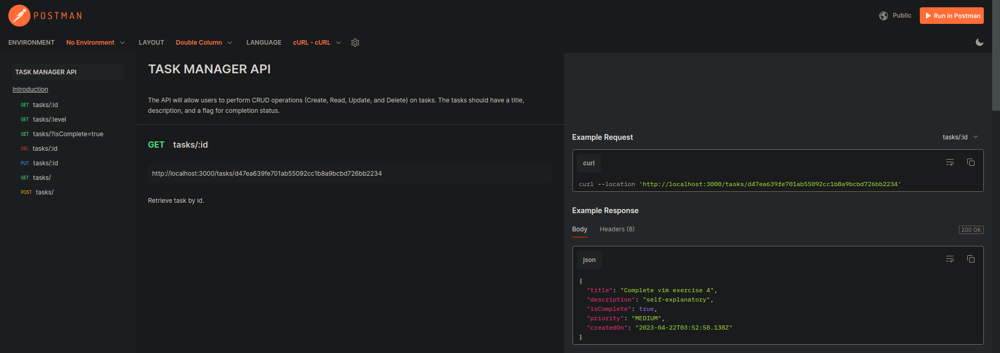

# TASK MANAGER API

## API docs

Postman doc - [ link ](https://documenter.getpostman.com/view/7984450/2s93Y3wMNx)


## Brief

The API will allow users to perform CRUD operations (Create, Read, Update, and Delete) on tasks. The tasks should have a title, description, and a flag for completion status.

Implement a RESTful API with the following endpoints:

```
GET /tasks: Retrieve all tasks.

GET /tasks/:id: Retrieve a single task by its ID.

POST /tasks: Create a new task.

PUT /tasks/:id: Update an existing task by its ID.

DELETE /tasks/:id: Delete a task by its ID.
```

Additional requirements:

```
Implement filtering and sorting for the GET /tasks endpoint. For example, users should be able to filter tasks based on completion status.

Allow users to assign a priority level (e.g., low, medium, high) to each task. Update the API to support this new attribute in task creation, updates, and retrieval.

Implement an endpoint to retrieve tasks based on priority level: GET /tasks/priority/:level.
```

## Installation

```shell
npm i
```

## Run the server

```shell
npm start
```
